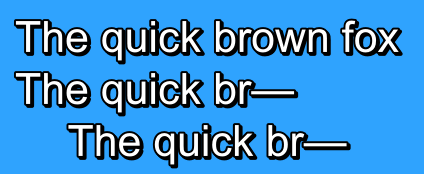

# petzku's Aegisub scripts

Automation scripts for Aegisub. These are probably mostly useful for typesetters, if anyone.

## Required modules

### DependencyControl

Scripts I make will use [DependencyControl](https://github.com/TypesettingTools/DependencyControl) for versioning and dependency management.

## Scripts

Generally, the more useful scripts here will be available to download through DependencyControl. Very minor and very WIP scripts are less likely to be published there.

### Accenter

**I don't recommend using this in its current form.** I've come across certain rendering issues with these (plus, layering can be a problem anyway when borders would overlap with fills). I'll try to fix what issues exist, but it's not terribly high on my list of priorities. Besides, modifying fonts to add glyphs isn't terribly hard.

Adds diacritics (accents) to lines based on inline comments. Sometimes you want to use glyphs that don't exist in a font, but don't want to or can't edit the font. So you add lines with the shapes you want. But maybe you don't want to position them manually, or maybe the script isn't final yet so you can't. Enter Accenter. Fairly simple instructions given before a character get turned into a line with a diacritic at the character's position.

For example, the line

```ass
Te{!aˇ}st li{\c&H6C42F7&}{!amacron}{!a+10grave}ne as{!b`}d{\c&H1C9C3A&\3c&HEBEBEB&}f{!b+5˘}h
```

turns into this (with ASS garbage stripped out):

```ass
Te{!aˇ}st li{\c&H6C42F7&}{!amacron}{!a+10grave}ne as{!b`}d{\c&H1C9C3A&\3c&HEBEBEB&}f{!b+5˘}h
{\pos(826.02,995.00)\an5}ˇ
{\pos(940.20,995.00)\an5\c&H6C42F7&}ˉ
{\pos(940.20,985.00)\an5\c&H6C42F7&}`
{\pos(1091.08,1051.52)\an5\c&H6C42F7&}`
{\pos(1154.54,1046.52)\an5\c&H6C42F7&\c&H1C9C3A&\3c&HEBEBEB&}˘
```

And here's how it looks:


The script creates the lines with `accent` in the effect field, so they're easy to remove, and get automatically cleaned up when running it again. The marker tag blocks are also left intact.

The full syntax for this can be found in the script's README comments. I do not guarantee backwards compatibility before 1.0, in fact I'm currently considering alternatives for the `a`/`b` labels for above/below.

### Autowrapper

Goes through the entire script, adding `\q2` to any lines with manual line breaks (`\N`), removing `\q2` from one-liners that don't have manual line breaks, and flagging any two-liners without manual line breaks.

Might not always be 100% accurate, though in most usage should only flag false positives rather than negatives. Main problems are in cases where libass and vsfilter disagree on line wrapping (thus far, I've had the script always match vsfilter output where this differs from libass). Does not care about tags in the line (other than `\q2`). Obviously `\fscx` would affect line width, but sometimes simply `\i1` can do so as well. I may eventually add support for inline tag handling.

### Clip Size

Tells you the distances between points in a vector clip on the selected line. The utility of this is debatable, but I find it useful to quickly compare sizes of similar signs or text in different parts of the video.

### Combine Gradient Lines

Combines consecutive identical stripes of a rectangular clip gradient. Say you create a 5px-wide stripe gradient on a 1200 px wide shape, going from a color of `&H4C4CFF&` (soft pink-red color) to `&H2020FF&` (fairly bright red):

```ass
Comment: 0,0:00:00.00,0:00:05.00,Default,,0,0,0,,{\pos(799,613)\c&H4C4CFF&\p1}m 448 402 l 384 834 1520 786 1666 250
Comment: 0,0:00:00.00,0:00:05.00,Default,,0,0,0,,{\pos(799,613)\c&H2020FF&\p1}m 448 402 l 384 834 1520 786 1666 250
```

This results in lots of lines that have adjacent clips but are otherwise identical. The macro goes through these, and combines two consecutive lines iff they both have a rectangular clip, the two lines are identical except for the clip, and the rectangles share one edge.

Should work on any properly formed rect-clip-using gradients. Probably produces weird results if ran on anything else.

### Encode Clip

As of 0.6.0, depends on [petzku.util](#util), and has configuration support with DependencyControl. The mpv executable path can be specified here, as well as custom encoding options.
As of 0.7.0, these options include specifying an audio encoder to use (otherwise, defaults to the best possible AAC encoder available, as it did before).

**Requires `mpv` to work**. If the mpv executable is not on your PATH, its location must be specified via the configuration menu. Some resources for setting PATH on [Windows](https://docs.alfresco.com/4.2/tasks/fot-addpath.html), [macOS](https://apple.stackexchange.com/questions/51677/how-to-set-path-for-finder-launched-applications/51678), [Unix/Linux](https://unix.stackexchange.com/questions/286354/setting-path-environment-variable-for-desktop-launchers). Most Unix- and Unix-like systems will just install mpv on your system PATH anyway, so this shouldn't be a hassle.

Encodes a clip of the current video, with audio, video, and hardsubs toggleable. Start and end time are determined from subtitle selection. The resulting file is saved in the same directory as the subtitle file, with a name based on the subtitle file's name and selection times. For example: `01 Dialogue.ass` -> `01 Dialogue_45.960-62.250.mp4`. In case you have no subtitle file open, it saves in a similar fashion in the video file's directory instead.

All five encoding modes are available through the GUI, as well as individual non-GUI macros.

Thanks to The0x539 for the original version.

### Extrapolate Move

Takes a line with a partial-duration move and extends it to the line's full duration. For instance, a line with duration of 3000 ms and a movement of `\move(320,200,520,100,1000,2000)` would end up with `\move(120,300,720,0)`. Useful for doing linear movements when you can't align the start and/or end points with traditional means (maybe because they're offscreen).

### Jump to Next++

Adds a mode to unanimated's [Jump to Next](https://github.com/unanimated/luaegisub/blob/master/ua.JumpToNext.lua) script, allowing you to jump by lines' start and end times. The script should work standalone too, if these are the only features you want out of it.

### Margin Position

Transforms `\pos`-based positioning data (such as Mocha tracking) to margins, thus making it not be automatically detected as typesetting.
Also does the inverse (transform margins into `\pos`).

Handles positioning on both axes, and all bottom- or top-aligned alignments, specified either inline or in styles. (middle alignments don't use margins for vertical positioning). As margins are restricted to integer values, this is not really usable for actual motion tracking, but should be enough for dialogue shenanigans.

**WARNING:** older versions of Aegisub (at the time of writing, this is most commonly used builds) do not handle opening files with negative margin values correctly (negative values are simply clamped to zero). If you use this macro, beware of those values being silently discarded.

### New Clip Shape

Hotkeyable macro to turn the last point of the active line's vectorial clip into a new "origin point" (i.e. `m 0 0 l 50 50 100 100` into `m 0 0 l 50 50 m 100 100`). Works for `l` as well as `b` (though it relies on Aegisub to fix potentially malformed shapes).

### Phantom

Helps with messing with dialogue layout using `\alphaFF`, somewhat akin to LaTeX `\phantom`. Split the line into three parts with `{}` (an empty tag section) to signify which part should be "hidden", and which part should "replace" it. If using the `Align start` mode, this should be `common{}replace{}hidden`; for `Align end`, `hidden{}replace{}common`. To demonstrate this better, in the image below, the "common" part is `The quick br`, "replace" is `—` (the em dash), and the "hidden" part is `own fox`, i.e. `The quick br{}—{}own fox`.


_Demonstration of the Phantom macro. The top and bottom lines are completely unmodified, the middle line is Phantomed to align exactly with the full line._

If you're using a new-ish Aegisub build that includes the Lua GUI API (such as [arch1t3ct's](https://github.com/arch1t3cht/Aegisub)), there is a third macro, `By cursor`, that determines the sections and direction from the selection. Simply select the "replace" part (i.e. `—` in the example above), starting the selection from the direction that should remain aligned (i.e. left to right).

### Split Timer

Automatically splits any lines longer than a given threshold, retiming transforms and moves so rendering should be unaffected. `10 second chunks` has a threshold of 10 seconds, useful to account for player lookback buffers. `N frames` prompts for a length of frames, and uses that as the threshold.

`On video frame` behaves slightly differently, emulating Aegisub's built-in "Split lines before current frame" function, but still accurately preserving transforms.

It is good to note, though, that `\move` has the erratic behavior that treats negative start- and end-times as if neither had been passed—essentially "breaking" this macro. The simple fix is to make it simply a `\pos` in these cases. (I should address this soon-ish)

### Typewriter

Takes a line and "writes" it character by character, making the characters appear one by one (using alphas) either frame-by-frame or evenly spaced over the line's duration. My first script, initially made before I even knew what the hell alpha-timing was and actually deleted characters from the string to make this work. Obviously this has been changed since.

Also has a mode (under a second automation menu entry, aptly named `Unscramble`) to unscramble the text one letter at a time as it is being written out. The most recent character gets randomized each frame, with matching upper/lowercase for letters, numbers for numbers, and keeping any other characters untouched. This one doesn't have a frame-by-frame setting, for hopefully-obvious reasons.
You should probably either use a monospaced font, or use one of `\an1 \an4 \an7` with this, since the text width will not stay constant. Nothing I can do about that, sorry. In extreme cases, this could even cause text re-flows. Also note that this uses lua's `string.upper` and `string.lower`, so it might not handle non-ASCII letters correctly, depending on your locale settings.

The unscrambling mode allows users to optionally specify how many frames a letter should stay static (i.e. displaying as itself instead of a random letter) before the next letter appears. This is one frame for the normal `Unscramble/line` macro, half of the letter's "duration" for `Unscramble/half` (rounded down), and `Unscramble/N static` allows the user to specify a number of frames. There is also a mode named `Unscramble/N fade` that makes the letters fade in over a given number of frames.

As of 0.6.1, also retimes any `\t`s, `\move`s, and `\fad`/`\fade`s, transforming them into the complex forms where necessary (depends on petzku.util to do this). Actually computing the resulting values would be hilariously out of scope. Just hope the renderer doesn't have a problem with times outside the current line (they shouldn't).

## Libraries

These should be placed in your Aegisub automation folder in `include/petzku/*`, e.g. `automation/include/petzku/util.moon`. Installing macros via DependencyControl handles this automatically.

### Util

Generic utilities for my stuff. Expect most scripts to require this fairly soon in the future.

### Easings

A collection of [easing functions](https://easings.net/) and a framework to let people use arbitrary easing functions, should they so desire. Pre-defines a bunch of the more complex easing functions from the link above. Mainly intended for use in ktemplates, but nothing's stopping you from using it elsewhere.

#### Usage

Each "easer" method has three required required parameters, and one optional one: A `{tag, start_value, end_value}` triple, or a table of multiple ones; start and end times for the effect (`t1` and `t2`); and a parameter determining how long each transform should be (`framestep`, defaults to 1). Higher `framestep` values reduce the output length, but may look choppy with some animations. Values below 1 should not produce visibly different results.
See example in the [Sample](#sample) section below.

The module exposes a bunch of methods in the format `(in|out|inout)_<effectname>`. The same methods are also accessible either via `i`/`o`/`io` tables (for in/out/in-out) with the effect name as the key, and vice versa:

```lua
ease = require 'petzku.easings'
-- all of the following call the same function:
ease.in_back(...)
ease.i.back(...)
ease.back.i(...)
```

There is also a `custom` method, which takes as its first parameter a user-supplied function to calculate the "easing factor" (i.e. `ease.custom(custom_function, tags, t1, t2)`).
The function should take one parameter in the range `[0,1]` (representing time between `t1` and `t2`), and produce a value describing the current state between `start_value` and `end_value`. The return value need not be clamped to `[0,1]`, in case an "overshooting" effect is desired.

#### Sample

In a karaoke template:

```
code once:     ease = _G.require 'petzku.easings'
template line: {!ease.out_bounce({"yshad", -200, 0}, 0, 1500)!\xshad-100\t(0,1500,\xshad1)\1a&HFE&\3a&HFF&\bord3}
template line: {!ease.out_bounce({"yshad", -200, 0}, 0, 1500)!\xshad-100\t(0,1500,\xshad1)\1a&HFE&\3a&HFF&\bord0\4c&H000000&}
```

Makes the text "bounce" in over 1.5 seconds from a height of 200 px, while moving right 100 px (thus generating a fairly convincing "bounce-in" effect).

## Not-really-published scripts

These scripts aren't available through DepCtrl for various reasons (usually because they're WIP and/or very specific). For related reasons, I won't always update them to the `master` branch either. You're free to download and use them from here, but it'll usually be worth checking if there's a more recent version on some other branch.

### Cells Box

Written to automatically generate the infoboxes in Cells at Work season 2, because I wanted them to be fast to generate, and more importantly, consistent. Not on DepCtrl (now or likely ever), this is fairly specialised for the exact use case. Feel free to copy/use as you see fit, though.

Specifically, the macro expects the style defaults to be `\an4\fs50\fnPT Sans` and the sign to be in one ASS event, with lines split by `\N`. The lines are split into separate events and positioned accordingly, and a box is drawn around them. Fades are accounted for (border layer is \1aFF for the duration of the fade).

### Resample

Don't use this, use [arch1t3ct's one](https://github.com/TypesettingTools/arch1t3cht-Aegisub-Scripts#resample-perspective) instead. Consider this script deprecated, and likely to be removed from the repo soon.

~~Corrects 3D-rotations (`\frx\fry`) when resampling script resolutions. Uses trigonometry instead of the classic "multiply by the ratio of the resolutions" and also scales subtitle dimensions when necessary, so this handles even extreme rotations correctly, or at least very nearly so. Still kind of experimental, though I see little reason not to use this if you ever end up resampling scripts.~~

~~Somewhat WIP. Does not always handle in-line `bord` and `shad` tags correctly. Also, I've been told the math I've used relies on incorrect assumptions, but it seemed to work correctly in all my testing.~~

### Shake

"Shakes" each line in the selection, randomizing its position within a given radius. Takes two numbers, one for the amplitude (= shake radius, in pixels) for the first line, the other for the last line. Interpolates the amplitude linearly between these two.

Typically, you would want the lines to be frame-by-frame, but the script doesn't actually enforce this at all. The positions before shaking don't have to be aligned either. So you could split the frames to match a lower-framerate animation, or run the script on an already-motiontracked sign.

### Snapper

Hotkeyable macros to snap the current line's start time to the previous keyframe, and end time to the next keyframe. Both runnable individually. If the start/end time is already on a keyframe, nothing will change.
